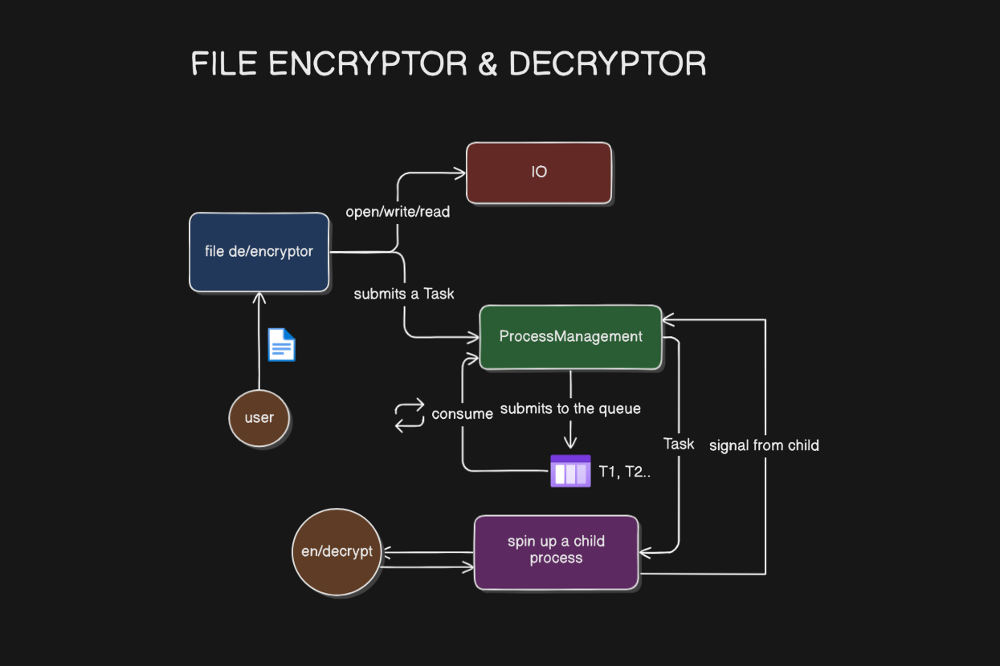

# ByteLock

## Project Description
ByteLock is a high-performance, multi-process file encryption and decryption tool written in C++. By leveraging both multiprocessing and multithreading, the project aims to enhance the efficiency and performance of cryptographic operations. It recursively processes all files in a user-specified directory, encrypting or decrypting them in parallel using a shared memory queue and semaphores for inter-process communication. The encryption key is securely read from a `.env` file. ByteLock is designed for speed, reliability, and ease of use, making it ideal for bulk file security operations.

---

## Features
- **Recursive Directory Processing:** Encrypts or decrypts all files in a given directory and its subdirectories.
- **Parallel Processing:** Utilizes multiple processes to handle files concurrently for maximum speed.
- **Shared Memory Queue:** Efficient task management using shared memory and POSIX semaphores.
- **Customizable Key:** Reads encryption/decryption key from a `.env` file for flexible security.
- **Robust Error Handling:** Gracefully manages file and system errors.
- **Cross-Platform Build:** Simple compilation using a Makefile.
- **Process Management:** Implements process creation and management using fork().
- **Task Queue:** Manages encryption and decryption tasks using a queue structure.
- **Task Execution:** Child processes execute tasks independently, allowing parallel processing.
---

## Installation Instructions
1. **Clone the repository:**
   ```sh
   git clone <repo-url>
   cd ByteLock
   ```
2. **Set up the encryption key:**
   - Create a `.env` file in the root directory containing a single integer (the key), e.g.:
     ```
     42
     ```
3. **Build the project:**
   ```sh
   make
   ```
4. **(Optional) Generate test files:**
   ```sh
   python3 makeDirs.py
   ```

---

## Usage Guide
1. **Run the main program:**
   ```sh
   ./encrypt_decrypt
   ```
2. **Follow the prompts:**
   - Enter the directory path to process.
   - Enter the action: `encrypt` or `decrypt`.

All files in the directory (and subdirectories) will be processed in parallel.

---

## Technologies Used
- **C++17**
- **POSIX APIs:** Shared memory, semaphores, process management
- **Standard C++ Libraries:** `<filesystem>`, `<fstream>`, `<mutex>`, etc.
- **Makefile** for build automation
- **Python** (for test file generation)

---

## System Architecture / Flow Diagram



### System Flow Explanation

1. **User Input:**
   - The user specifies the target directory and the action (encrypt/decrypt).
2. **Directory Traversal:**
   - The system recursively scans all files in the specified directory.
3. **Task Creation:**
   - For each file, a task is created (either encryption or decryption) and added to a shared memory queue.
4. **Parallel Processing:**
   - Each task is picked up by a separate process (using `fork()`), allowing multiple files to be processed simultaneously.
5. **Encryption/Decryption:**
   - Each process reads the encryption key from the `.env` file and performs the operation on its assigned file.
6. **Completion:**
   - The system waits for all child processes to finish, ensuring all files are processed.

#### **Diagram Breakdown**
- **Input Layer:** User prompt for directory and action.
- **Task Queue:** Shared memory structure holding pending tasks.
- **Process Pool:** Multiple processes spawned to handle tasks in parallel.
- **File Handler:** Each process opens, reads, and writes to files as needed.
- **Key Management:** Reads the key from `.env` for each operation.
- **Synchronization:** Semaphores ensure safe access to the shared queue.

---

## Contributing Guidelines
- Fork the repository and create a feature branch.
- Write clear, concise commit messages.
- Ensure code is well-documented and formatted.
- Submit a pull request with a detailed description of your changes.

---
